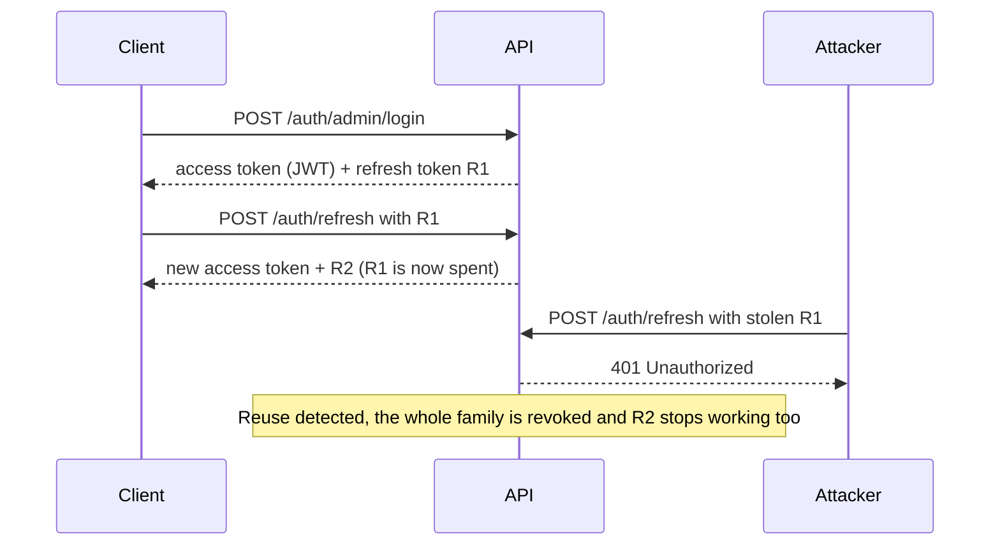

<div align="center">

# NestJS Starter

**A production-ready [NestJS](https://nestjs.com) 11 + PostgreSQL boilerplate for secure REST APIs.**

JWT auth with refresh-token rotation, role-based access control, Arabic/English i18n, file storage, WhatsApp OTP, push notifications, rate limiting, Zod-validated config, and reviewed TypeORM migrations — so a new backend starts on solid foundations instead of a blank `main.ts`.

[](https://github.com/aymansalkhatib/nestjs-starter/actions/workflows/ci.yml)
[](https://nestjs.com)
[](https://www.typescriptlang.org)
[](https://typeorm.io)
[](https://www.postgresql.org)
[](https://nodejs.org)
[](#testing)
[](#testing)

</div>

> **Reusable base project.** The shipped feature modules (admins, users, cities, areas, OTPs, refresh tokens, WhatsApp) are intentionally small and generic — they demonstrate the conventions for auth, lookups, and CRUD. Replace them with your own domain; the entire `infrastructure/` layer is reusable as-is. See [Make it yours](#make-it-yours).

## Table of Contents

- [Features](#features)
- [Tech Stack](#tech-stack)
- [Quick Start](#quick-start)
- [API Overview](#api-overview)
- [Project Structure](#project-structure)
- [Conventions](#conventions)
- [Environment Variables](#environment-variables)
- [Database & Migrations](#database--migrations)
- [Seeding](#seeding)
- [Internationalization](#internationalization)
- [Testing](#testing)
- [Docker](#docker)
- [Make it yours](#make-it-yours)
- [Scripts](#scripts)
- [License](#license)

## Features

- 🔐 **Authentication & sessions** — Admin (username + password) and User (phone + WhatsApp OTP) flows. Short-lived JWT access tokens (HS256 pinned) plus **opaque, hashed, DB-backed refresh tokens with rotation and reuse/theft detection**.
- 🛡️ **Role-based access control** — one `@Protected(Role.X)` decorator and a resolver registry. The global guard is **fail-closed** (every route needs a token unless marked `@Public()`), hydrates the principal without any feature module importing another's repository, and enforces a soft `is_active` account gate.
- 🌍 **i18n out of the box** — Arabic + English via `nestjs-i18n`, with a **type-safe, auto-generated translation-key union** and localized validation messages.
- 📦 **File storage abstraction** — local filesystem or Supabase, signed URLs for private files, **magic-byte content validation**, and Sharp-based image processing.
- 🔔 **Notifications** — Firebase Cloud Messaging push + WhatsApp (Baileys), with a stub driver that logs messages in development.
- 🚦 **Rate limiting** — a global per-IP limit plus stricter named throttlers for auth and upload routes, shared across instances through Redis when `CACHE_DRIVER=redis`.
- ✅ **Validated configuration** — every environment variable is parsed and validated by **Zod** at boot; the app refuses to start on missing or malformed values.
- 🗃️ **Reviewed migrations** — schema-scoped TypeORM migrations that test and production apply automatically on boot.
- 📑 **Consistent API surface** — `{ data, pagination? }` response envelope, opt-in snake_case, UTC date serialization, `X-Request-Id` correlation IDs, and a global exception filter mapping DB/JWT/Multer errors to clean responses.
- 🩺 **Health probes** — `/healthz` (liveness) and `/healthz/ready` (database readiness), kept outside the versioned API for load balancers and Kubernetes.
- 🧪 **Tested & CI-ready** — 409 unit tests at ~95% line coverage on the logic layers, an e2e suite with a Postgres-backed auth flow, and a GitHub Actions pipeline.
- 🐳 **Deployable** — multi-stage Dockerfile (non-root, healthcheck) and helmet/CORS/compression/body-limit/trust-proxy hardening wired in `bootstrap/`.
- 📮 **Postman collection** — every API endpoint with example bodies; tokens are captured automatically when you log in.
- 🤖 **AI-assisted scaffolding** — a `CLAUDE.md` plus Claude Code skills that scaffold modules, endpoints, entities, i18n keys, and Postman collections in the house style.

## Tech Stack

- **[NestJS 11](https://nestjs.com)** with the Nest CLI build pipeline
- **[TypeORM 0.3](https://typeorm.io)** + **[PostgreSQL](https://www.postgresql.org)** with reviewed migrations
- **[Zod](https://zod.dev)** for environment validation
- **[nestjs-i18n](https://nestjs-i18n.com)** (Arabic + English by default, easy to extend)
- **JWT** access tokens (`jsonwebtoken`, HS256 pinned) + opaque refresh-token rotation
- **[class-validator](https://github.com/typestack/class-validator)** with localized error messages
- **Storage**: local FS or **[Supabase](https://supabase.com)** (signed URLs for private files), **[Sharp](https://sharp.pixelplumbing.com)** image processing
- **Notifications**: **[Firebase Admin](https://firebase.google.com/docs/admin/setup)** push + **WhatsApp ([Baileys](https://github.com/WhiskeySockets/Baileys))** with a stub driver for dev
- **[Helmet](https://helmetjs.github.io) + compression + CORS + body limits + trust-proxy** wired in `bootstrap/`
- **[Jest](https://jestjs.io)** unit + e2e, **[ESLint](https://eslint.org)** + **[Prettier](https://prettier.io)**

## Quick Start

**Prerequisites:** Node.js ≥ 20 and PostgreSQL 14+ (Redis is optional — only needed for `CACHE_DRIVER=redis`).

```bash
# 1. Install dependencies
npm install

# 2. Start PostgreSQL. This matches the committed defaults in env/.env.development
#    (no real secrets) — or point that file at your own instance.
docker run -d --name nestjs-starter-db -p 5432:5432 -e POSTGRES_PASSWORD=password postgres:16-alpine

# 3. (Optional) Seed sample lookups, an admin, and demo users
npm run seed:dev

# 4. Run in watch mode
npm run start:dev
```

No migration step is needed locally: in development the app creates the database and schema on first boot and syncs the tables from your entities. The server listens on `PORT` (honored first, for platforms that inject it) or `APP_PORT` (default `3000`).

### Try it

Log in as the seeded admin:

```bash
curl -X POST http://localhost:3000/api/v1/auth/admin/login \
  -H 'Content-Type: application/json' \
  -d '{"username":"admin","password":"Admin@12345"}'
```

```json
{
  "data": {
    "accessToken": "eyJhbGciOiJIUzI1NiIs...",
    "refreshToken": "c2Vzc2lvbi1yZWZyZXNo...",
    "user": {
      "role": "admin",
      "id": 1,
      "username": "admin",
      "firstName": "Admin",
      "lastName": "User",
      "phone": null,
      "photoUrl": null,
      "createdAt": "2026-10-04T10:25:32.573Z",
      "updatedAt": "2026-10-04T10:25:32.573Z"
    }
  }
}
```

Send the access token as `Authorization: Bearer <accessToken>` to call protected routes such as `GET /api/v1/admin/me`.

Users sign in with a WhatsApp OTP. In development the stub driver logs the code instead of sending it, and `OTP_FIXED_CODE=000000` keeps it predictable:

```bash
curl -X POST http://localhost:3000/api/v1/auth/user/otp/request \
  -H 'Content-Type: application/json' -d '{"phone":"0936000001"}'

curl -X POST http://localhost:3000/api/v1/auth/user/otp/verify \
  -H 'Content-Type: application/json' -d '{"phone":"0936000001","code":"000000"}'
```

## API Overview

Feature routes are versioned under `/api/v1`; the paths below are relative to it. Health probes (`GET /healthz`, `GET /healthz/ready`) and local file serving (`/storage/...`) sit outside the prefix.

| Area                     | Endpoints                                                                                         | Access                 |
| ------------------------ | ------------------------------------------------------------------------------------------------- | ---------------------- |
| Admin auth               | `POST /auth/admin/login`                                                                          | Public                 |
| User auth (WhatsApp OTP) | `POST /auth/user/otp/request` · `POST /auth/user/otp/verify`                                      | Public                 |
| Sessions                 | `POST /auth/refresh` · `POST /auth/logout`                                                        | Public (refresh token) |
| Admin profile            | `GET /admin/me` · `PATCH /admin/me` · `POST /admin/me/photo`                                      | Admin                  |
| User profile             | `GET /user/me` · `PATCH /user/me` · `POST /user/me/photo` · `POST /user/me/complete-profile`      | User                   |
| User management          | `GET /admin/users` · `POST /admin/users` · `GET /admin/users/:id`                                 | Admin                  |
|                          | `PATCH /admin/users/:id/activate` · `PATCH /admin/users/:id/deactivate`                           | Admin                  |
| Cities & areas           | `GET /cities` · `GET /cities/:id` — same for `/areas`                                             | Public                 |
|                          | `POST /cities/admin` · `PATCH /cities/admin/:id` · `DELETE /cities/admin/:id` — same for `/areas` | Admin                  |
| WhatsApp session         | `GET /admin/whatsapp/{qr,status}` · `POST /admin/whatsapp/{send,logout}`                          | Admin                  |

For ready-made requests, import [`postman/collections/nest-starter.postman_collection.json`](postman/collections/nest-starter.postman_collection.json) into Postman, set `base_url`, and log in — the collection stores the returned tokens for you. Each feature module also ships its own collection under `src/modules/*/postman/`.

### Session lifecycle

Refresh tokens are single-use. Replaying a spent one is treated as theft and revokes the whole token family:



## Project Structure

```text
src/
├── bootstrap/        # main.ts wiring: security, body limits, routing, DI
├── core/             # Cross-cutting NestJS plumbing: guards, decorators,
│                     # interceptors, middlewares, pagination, filters, pipes,
│                     # auth resolver registry
├── domain/           # Cross-module entities + enums (BaseAccountEntity, Role, ...)
├── infrastructure/   # Reusable platform modules: config, database, i18n,
│                     # jwt, storage, notifications, whatsapp-client, throttle, cache
├── modules/          # Feature modules — each owns its repository,
│                     # entities, DTOs, controllers, and services
├── database/         # TypeORM migrations
├── scripts/          # Operational scripts: i18n key check, seeder pipeline
├── shared/           # Tiny pure utils + ambient types
├── app.module.ts
└── main.ts
test/                 # End-to-end (e2e) test suite
```

Each infrastructure subfolder ships its own short README:

- [bootstrap/](src/bootstrap/README.md) — what happens between `NestFactory.create` and `app.listen`
- [core/](src/core/README.md) — `@Protected()`, `JwtAuthGuard`, pagination, response transforms
- [infrastructure/config/](src/infrastructure/config/README.md) — env vars + Zod validation
- [infrastructure/database/](src/infrastructure/database/README.md) — schema scoping, migration utils
- [infrastructure/i18n/](src/infrastructure/i18n/README.md) — `Translator`, key generation, language resolution
- [infrastructure/jwt/](src/infrastructure/jwt/README.md) — access-token signing + verification
- [infrastructure/notifications/](src/infrastructure/notifications/README.md) — Firebase push
- [infrastructure/storage/](src/infrastructure/storage/README.md) — file uploads (local / Supabase)
- [infrastructure/throttle/](src/infrastructure/throttle/README.md) — global + auth rate limiting
- [infrastructure/whatsapp-client/](src/infrastructure/whatsapp-client/README.md) — WhatsApp notifier (Baileys / stub)
- [scripts/](src/scripts/README.md) — i18n validation + seed pipeline

## Conventions

- Anything entity-specific lives inside the feature module that owns the entity — including admin-facing endpoints. `modules/admins/` is reserved for the Admin entity itself.
- Repositories never cross module boundaries. Cross-feature reads go through the owning module's service.
- Successful responses are wrapped as `{ data, pagination? }`; errors share one `{ statusCode, error, message }` shape.
- JSON keys are camelCase by default. Send `X-Case-Format: snake` to use snake_case for both the request and the response.
- Response language resolves from `?lang=ar|en`, `Accept-Language`, or the `X-Lang` header (first match wins; English is the fallback).
- Validation errors return `400` with localized messages.

A paginated list (`GET /api/v1/areas?page=1&limit=2`):

```json
{
  "data": [
    { "id": 1, "cityId": 1, "nameEn": "Old Damascus", "nameAr": "دمشق القديمة" },
    { "id": 2, "cityId": 1, "nameEn": "Mezzeh", "nameAr": "المزة" }
  ],
  "pagination": {
    "total": 210, "page": 1, "limit": 2, "totalPages": 105,
    "nextPage": 2, "prevPage": null, "hasNextPage": true, "hasPrevPage": false
  }
}
```

An error:

```json
{ "statusCode": 400, "error": "BAD_REQUEST", "message": "username is too short." }
```

In development, errors also carry a `context` block (path, method, stack) unless the request sends `x-developer-mode: false`.

See [CLAUDE.md](CLAUDE.md) and `.claude/skills/` for the full conventions and scaffolding guides.

## Environment Variables

Every variable is validated by Zod schemas in [src/infrastructure/config/schemas/](src/infrastructure/config/schemas/). The app refuses to boot on missing or malformed values — see those schemas for the authoritative list, and [`infrastructure/config/`](src/infrastructure/config/README.md) for an overview.

A few that almost always need attention before a fresh deploy:

| Variable            | Purpose                                                                      |
| ------------------- | ---------------------------------------------------------------------------- |
| `APP_URL`           | Public URL used for absolute links (storage signed URLs, etc.)               |
| `DB_SCHEMA`         | Postgres schema used by all entities and migrations                          |
| `JWT_ACCESS_SECRET` | HS256 signing key (min 32 chars)                                             |
| `CORS_ORIGINS`      | Comma-separated origin allowlist — never `*` in production                   |
| `TRUST_PROXY`       | Hops behind a reverse proxy. Must be correct for rate-limit IPs to work      |
| `STORAGE_DRIVER`    | `local` or `supabase`                                                        |
| `CACHE_DRIVER`      | `noop` or `redis` — `redis` also shares rate-limit counters across instances |
| `WHATSAPP_DRIVER`   | `stub` (logs messages) or `baileys` (a real WhatsApp session)                |

For production, copy `env/.env.production.example` to `env/.env.production` and replace every `CHANGE_ME_*` placeholder.

## Database & Migrations

| Environment       | Schema management                                                                      |
| ----------------- | -------------------------------------------------------------------------------------- |
| development       | Database and schema created on first boot; tables synced from entities (`synchronize`) |
| test / production | `synchronize` off; pending migrations run automatically on boot                        |

```bash
npm run migration:generate -- src/database/migrations/<Name>   # generate from entity diff
npm run migration:run                                          # apply pending
npm run migration:revert                                       # roll back the last one
npm run migration:show                                         # list applied / pending
```

- Every migration **must** start with `await scopeToConnectionSchema(queryRunner)` in both `up()` and `down()`; review generated SQL before committing it. See [`infrastructure/database/`](src/infrastructure/database/README.md) for why.
- The migration CLI expects the target schema to exist; booting the app creates it.
- The `:prod` variants (`migration:run:prod`, `migration:revert:prod`, `migration:show:prod`) run against the compiled `dist/`. When scaling to several replicas, run `migration:run:prod` once as a release step rather than letting every replica migrate on boot.

## Seeding

```bash
npm run seed:dev    # development: truncates users/admins/areas, then seeds lookups, the admin, and demo users
npm run seed:prod   # production: idempotent — upserts lookups and creates the admin if missing; never truncates
```

The sample lookups are Syria's 14 governorates and their areas. The admin comes from the `SEED_ADMIN_*` variables (`admin` / `Admin@12345` in development). The pipeline order is defined in [src/scripts/seed/seed-registry.ts](src/scripts/seed/seed-registry.ts). See [`scripts/`](src/scripts/README.md).

## Internationalization

JSON translation files live under `src/infrastructure/i18n/translations/{ar,en}/`. Add or edit keys there, then:

```bash
npm run i18n:sync
```

This validates parity between locales and regenerates `src/infrastructure/i18n/translation-keys.ts`. **Do not edit `translation-keys.ts` by hand** — it's overwritten on every run. See [`infrastructure/i18n/`](src/infrastructure/i18n/README.md).

## Testing

The suite is split into fast **unit tests** (co-located `*.spec.ts` next to the source) and an **e2e** suite (`test/`), following the NestJS convention.

```bash
npm test            # unit tests
npm run test:cov    # unit tests + coverage (enforces coverage thresholds)
npm run test:e2e    # e2e tests (the Postgres-backed suite runs with RUN_DB_E2E=1)
```

- **409 unit tests** covering services, guards, the refresh-token rotation/reuse logic, OTP lockout, validators, decorators, interceptors, middlewares, filters, pagination, cache, and utilities.
- **~95% line coverage** on the unit-tested logic layers, enforced by `coverageThreshold` in [package.json](package.json). Pure framework wiring, declarative DTOs/schemas, and integration-only adapters (storage providers, Firebase, Baileys) are scoped out of the unit-coverage gate and exercised by the e2e suite instead.
- **E2E:** an infra-free HTTP-pipeline test runs anywhere. The full **auth-flow** test (admin login → refresh rotation → reuse detection → protected route) needs Postgres: CI runs it with `RUN_DB_E2E=1`, and you can too against a local database (settings come from `env/.env.test`).
- **CI:** [.github/workflows/ci.yml](.github/workflows/ci.yml) runs `lint:check`, `build`, `test:cov`, and the Postgres-backed e2e job on every push and pull request.

## Docker

A multi-stage [Dockerfile](deploy/docker/Dockerfile) builds a slim, non-root production image with a `/healthz` healthcheck:

```bash
docker build -f deploy/docker/Dockerfile -t nestjs-starter .
docker run -p 3000:3000 --env-file env/.env.production nestjs-starter
```

The container applies pending migrations when it starts.

## Make it yours

1. Search for `TODO(per-project)` — the Postgres schema, JWT issuer/audience, and Redis key prefix in `env/`, plus the project header in `CLAUDE.md`.
2. Set `name`, `version`, and `description` in `package.json`; the landing page and `GET /api/info` display them.
3. Replace the sample modules in `src/modules/` with your own domain. The Claude Code skills in `.claude/skills/` scaffold new modules, entities, and endpoints in the same style.
4. The samples target Syria: OTP phone numbers are validated by `@SyriaPhone`, and the seeders load Syrian governorates and areas. Swap both for your market.
5. Before deploying, create `env/.env.production` from the example and replace every `CHANGE_ME_*` value.

## Scripts

| Script                               | What it does                                                                                       |
| ------------------------------------ | -------------------------------------------------------------------------------------------------- |
| `npm run start:dev`                  | Watch mode, `NODE_ENV=development`                                                                 |
| `npm run start:debug`                | Watch mode with the Node inspector attached                                                        |
| `npm run start:prod`                 | Production runtime against `dist/`                                                                 |
| `npm run build`                      | Nest CLI build + path-alias rewrite                                                                |
| `npm run lint` / `lint:check`        | ESLint with / without auto-fix                                                                     |
| `npm run format` / `format:check`    | Prettier write / check                                                                             |
| `npm test` / `test:cov` / `test:e2e` | Unit tests / with coverage gates / end-to-end                                                      |
| `npm run migration:<command>`        | `create`, `generate`, `run`, `revert`, `show` — see [Database & Migrations](#database--migrations) |
| `npm run i18n:sync`                  | Validate translations + regenerate key types                                                       |
| `npm run seed:dev` / `seed:prod`     | Run the seed pipeline                                                                              |

## License

UNLICENSED — see [package.json](package.json). Authored by Ayman Al-Khatib.
